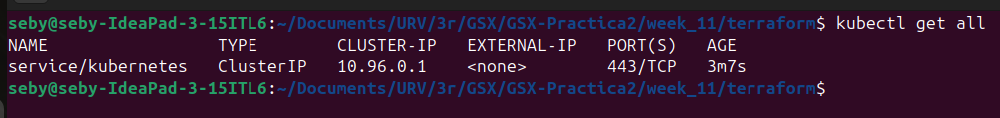
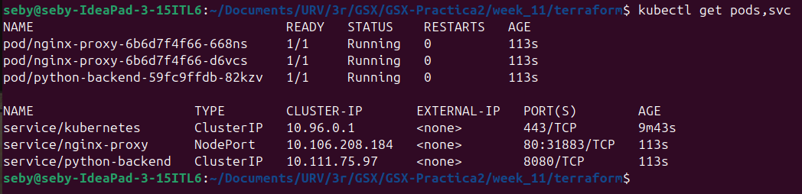
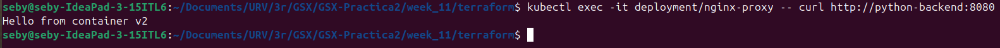
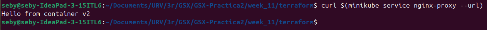
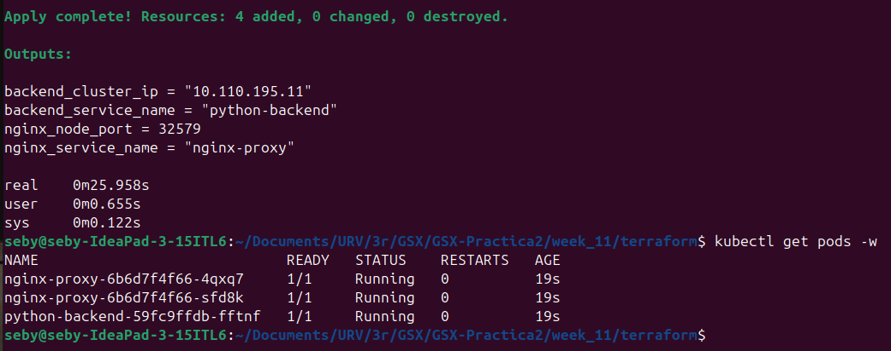

# 🚀 Challenge B: Full Integration Test Report

Aquest informe documenta el cicle de vida complet de la infraestructura de **GreenDevCorp**: des de l'eliminació total dels recursos fins a la verificació de la connectivitat i seguretat en producció.

## 1. Fase 1: Start from Scratch (Purga del sistema)

L'objectiu és assegurar que el sistema es pot aixecar sense cap dependència o resta de configuracions prèvies.

### Accions realitzades per garantir un estat net:

* **Eliminació controlada amb Terraform:** S'ha utilitzat Terraform per destruir els recursos existents i netejar el fitxer d'estat.
    ```bash
    cd week_11/terraform/
    terraform destroy -auto-approve
    ```


* **Neteja de seguretat en Kubernetes:** S'ha verificat que no quedin recursos orfes al namespace de treball.

    ```bash
    kubectl delete all --all -n default
    ```

### Verificació:
S'ha executat `kubectl get all` i s'ha confirmat que el clúster respon correctament i no conté cap recurs de l'aplicació.



---

## 2. Fase 2: Deploy from IaC Code
Fem el desplegament automatitzat mitjançant Infraestructura com a Codi.

1.  **Inici del clúster amb suport de xarxa:**
    Es llança Minikube.
    ```bash
    minikube start --cni=calico
    ```
2.  **Execució cronometrada de Terraform:**
    ```bash
    time terraform apply -auto-approve
    ```

---

## 3. Fase 3: End-to-End Verification

### A. Estat dels Serveis
*   **Comanda:** `kubectl get pods,svc`
*   **Resultat:** Tots els pods estan en estat **Running**. El servei `nginx-proxy` exposa correctament el NodePort.



### B. Comunicació Inter-Service (East-West)
*   **Test:** Verificació de que el Proxy arriba al Backend.
*   **Execució:** `kubectl exec -it deployment/nginx-proxy -- curl http://python-backend:8080`
*   **Resultat:** Resposta satisfactòria (200 OK) del backend de Python.



### C. Accés Extern (North-South)
*   **Test:** Accés des de l'host a través de la xarxa de Minikube.
*   **Acció:** `curl $(minikube service nginx-proxy --url)`
*   **Resultat:** L'aplicació és accessible des de l'exterior del clúster.



### D. NetworkPolicies Enforcement
*   **Test:** Intentar arribar al backend des d'un pod no autoritzat (simulació d'intrus).
*   **Execució:** `kubectl run mallory --image=busybox -it --rm -- wget -qO- --timeout=2 http://python-backend:8080`
*   **Resultat:** **Timeout**. La NetworkPolicy bloqueja el tràfic no permès, complint amb el principi de "Least Privilege".


---

## 4. Documentació del Procés i Mètriques

### Mètriques de Temps
*   **Temps de desplegament total (Terraform):** 25.9 s
*   **Temps fins a l'estat "Ready":** 44.9 s



### Incidències i Solucions
| Problema detectat | Causa arrel | Solució aplicada |
| :--- | :--- | :--- |
| Error `invalid character 'H'` | Es van esborrar manualment components de `kube-system`. | Reinici complet de Minikube per restaurar el Control Plane. |
| NetworkPolicies no bloquejaven | El clúster es va iniciar sense un CNI compatible. | Reinici de Minikube utilitzant el paràmetre `--cni=calico`. |

---

### Conclusió
El sistema de **GreenDevCorp** s'ha demostrat totalment reproduïble i segur. La integració entre Terraform i Kubernetes permet restaurar tot l'entorn productiu en pocs minuts, garantint la disponibilitat i la segmentació de xarxa requerida.
